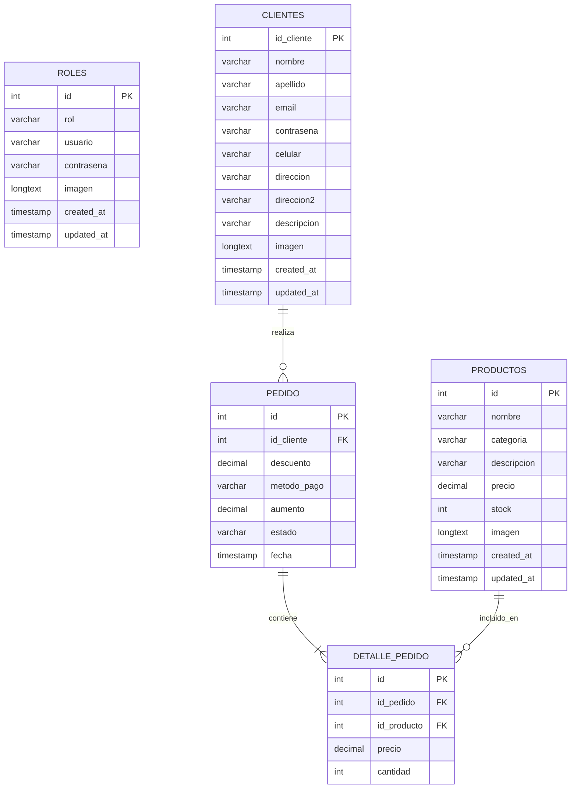

# 🍔 POCHECHES FAST FOOD — DOCUMENTACIÓN INTEGRAL DEL SISTEMA

> **Proyecto Educativo CESDE 2026**  
> **Desarrollado por:** Sebastian, Bryan y Yadir  
> **Sistema:** Plataforma Web de Gestión Comercial, Control de Inventario, Facturación y Reportes Estadísticos  

---

## 📑 TABLA DE CONTENIDO
1. [Ficha Técnica del Proyecto](#1-ficha-técnica-del-proyecto)
2. [Arquitectura del Sistema y Estructura de Archivos](#2-arquitectura-del-sistema-y-estructura-de-archivos)
3. [Modelo y Esquema de Base de Datos (MySQL)](#3-modelo-y-esquema-de-base-de-datos-mysql)
4. [Matriz de Roles y Seguridad (RBAC)](#4-matriz-de-roles-y-seguridad-rbac)
5. [Módulos y Procesos del Aplicativo](#5-módulos-y-procesos-del-aplicativo)
   - [5.1 Autenticación y Gestión de Perfil](#51-autenticación-y-gestión-de-perfil)
   - [5.2 Gestión de Productos e Inventario](#52-gestión-de-productos-e-inventario)
   - [5.3 Gestión de Clientes](#53-gestión-de-clientes)
   - [5.4 Módulo de Pedidos y Ventas](#54-módulo-de-pedidos-y-ventas)
   - [5.5 Facturación Digital e Impresión Formal](#55-facturación-digital-e-impresión-formal)
   - [5.6 Panel de Control y Reportes Web con Gráficas](#56-panel-de-control-y-reportes-web-con-gráficas)
   - [5.7 Suite de Reportes en Python (PDF, Gráficas y CSV)](#57-suite-de-reportes-en-python-pdf-gráficas-y-csv)
6. [Referencia de API REST (Endpoints)](#6-referencia-de-api-rest-endpoints)
7. [Guía de Instalación y Despliegue Rápido](#7-guía-de-instalación-y-despliegue-rápido)

---

## 1. FICHA TÉCNICA DEL PROYECTO

* **Nombre de la Aplicación:** Pocheches Fast Food Management System
* **Tipo de Aplicación:** SPA / MPA Híbrida con API RESTful Backend y Suite de Reportes Python.
* **Stack Tecnológico:**
  * **Backend:** Node.js v18+, Express.js, MySQL2 (Connection Pool), CORS, Body-Parser, Dotenv.
  * **Base de Datos:** MySQL 8.0 / MariaDB (`inventario_db`) con motor InnoDB y cotejamiento `utf8mb4_unicode_ci`.
  * **Frontend:** HTML5 Semántico, CSS3, JavaScript ES6+ (Modular Vanilla), Bootstrap 4.6, SB Admin 2, FontAwesome 6, Chart.js.
  * **Python Suite:** Python 3.10+, ReportLab (Generador de documentos PDF), Matplotlib (Diagramas de barras), CSV, Requests / Urllib.

---

## 2. ARQUITECTURA DEL SISTEMA Y ESTRUCTURA DE ARCHIVOS

```text
📦 Primer momento/
 ┣ 📂 BACKEND_TIENDA_NODE_MYSQL/         # Servidor API RESTful
 ┃ ┣ 📂 src/
 ┃ ┃ ┣ 📂 controllers/                  # Controladores de lógica de negocio
 ┃ ┃ ┃ ┣ 📜 authController.js           # Login híbrido de empleados y clientes
 ┃ ┃ ┃ ┣ 📜 productosController.js      # CRUD de productos y control de stock
 ┃ ┃ ┃ ┣ 📜 clientesController.js       # CRUD y perfil de clientes
 ┃ ┃ ┃ ┣ 📜 usuariosController.js       # CRUD de empleados y roles
 ┃ ┃ ┃ ┣ 📜 pedidosController.js        # Transacciones de pedidos y bloqueo
 ┃ ┃ ┃ ┗ 📜 detallePedidoController.js  # Detalle individual de ítems
 ┃ ┃ ┣ 📂 database/                     # Configuración de base de datos
 ┃ ┃ ┃ ┣ 📜 connection.js               # Pool MySQL2 con límite 64MB
 ┃ ┃ ┃ ┗ 📜 init.js                     # Auto-creación, auto-migración y semillas
 ┃ ┃ ┣ 📂 routes/                       # Enrutadores Express
 ┃ ┃ ┗ 📂 utils/                        # Manejador centralizado de errores
 ┃ ┣ 📂 scripts/
 ┃ ┃ ┗ 📜 init-db.js                    # Script CLI para 'npm run init-db'
 ┃ ┣ 📜 .env                            # Variables de entorno locales
 ┃ ┣ 📜 .env.example                    # Plantilla de variables para nuevos entornos
 ┃ ┣ 📜 database.sql                    # Dump SQL listo para phpMyAdmin
 ┃ ┣ 📜 package.json                    # Dependencias y scripts de Node
 ┃ ┗ 📜 server.js                       # Punto de entrada del servidor Express
 ┣ 📂 frontend-apicrud/                  # Interfaz de Usuario Web
 ┃ ┣ 📂 css/                            # Hojas de estilo y temas
 ┃ ┣ 📂 js/                             # Controladores JavaScript Modulares
 ┃ ┃ ┣ 📜 local.js                      # Seguridad por roles y anti-parpadeo
 ┃ ┃ ┣ 📜 login.js                      # Envío y validación de sesión
 ┃ ┃ ┣ 📜 registrarUsuario.js           # Registro público de nuevos clientes
 ┃ ┃ ┣ 📜 dashboard.js                  # Estadísticas dinámicas de inicio
 ┃ ┃ ┣ 📜 listado-pro.js                # Catálogo interactivo y filtros
 ┃ ┃ ┣ 📜 crearProducto.js              # Creación de productos con selector
 ┃ ┃ ┣ 📜 listadoClientes.js            # Directorio y edición modal de clientes
 ┃ ┃ ┣ 📜 crearCliente.js               # Formulario de registro de clientes
 ┃ ┃ ┣ 📜 listadoPedidos.js             # Listado con filtros y estados bloqueados
 ┃ ┃ ┣ 📜 crearPedido.js                # Carrito dinámico, domicilios y promociones
 ┃ ┃ ┣ 📜 listadoUsuarios.js            # Administración de cuentas de empleados
 ┃ ┃ ┣ 📜 crearUsuario.js               # Creación de cuentas y asignación de rol
 ┃ ┃ ┣ 📜 perfil.js                     # Perfil con compresión Canvas 400x400
 ┃ ┃ ┣ 📜 factura.js                    # Vista e impresión formal de facturas
 ┃ ┃ ┗ 📜 reportes.js                   # Métricas y gráficas Chart.js
 ┃ ┣ 📜 index.html                      # Panel de Control principal
 ┃ ┣ 📜 login.html                      # Inicio de sesión corporativo
 ┃ ┣ 📜 register.html                   # Registro de clientes
 ┃ ┣ 📜 listado-pro.html                # Vista de productos
 ┃ ┣ 📜 crear-pro.html                  # Creación de productos
 ┃ ┣ 📜 listado-clientes.html           # Vista de clientes
 ┃ ┣ 📜 crear-cliente.html              # Creación de clientes
 ┃ ┣ 📜 listado-pedidos.html            # Vista de pedidos
 ┃ ┣ 📜 crear-pedido.html               # Formulario de pedidos
 ┃ ┣ 📜 listado-usuarios.html           # Vista de usuarios del sistema
 ┃ ┣ 📜 crear-usuario.html              # Creación de usuarios
 ┃ ┣ 📜 perfil.html                     # Perfil del usuario autenticado
 ┃ ┣ 📜 factura.html                    # Factura formal imprimible
 ┃ ┗ 📜 reportes.html                   # Módulo de reportes y ventas
 ┗ 📂 reportes_python/                   # Suite de Informes Ejecutivos Python
   ┣ 📜 generar_factura.py              # Generador de Factura individual en PDF
   ┣ 📜 reporte_ventas.py               # Generador de Informe General + Gráfica + CSV
   ┣ 📜 grafica_ventas.png              # Diagramas de barras generados con Matplotlib
   ┣ 📜 reporte_ventas_pocheches.pdf    # PDF con métricas y gráficas incrustadas
   ┗ 📜 reporte_clientes_vip.csv        # Exportación de ranking VIP para Excel
```

---

## 3. MODELO Y ESQUEMA DE BASE DE DATOS (MYSQL)



### Definición Detallada de Tablas:

1. **`roles` (Usuarios con acceso administrativo):**
   * `id`: Identificador autoincremental único.
   * `rol`: Rol del usuario (`administrador`, `vendedor`, `cajero`).
   * `usuario`: Nombre de usuario único para inicio de sesión.
   * `contrasena`: Clave de acceso.
   * `imagen`: Avatar en formato `LONGTEXT` (soporta Base64 o URLs).

2. **`clientes` (Directorio de Compradores):**
   * `id_cliente`: Identificador numérico único del cliente.
   * `nombre` / `apellido`: Nombres completos del cliente.
   * `email`: Correo electrónico único (usado también para login de cliente).
   * `contrasena`: Clave para acceso de clientes al sistema.
   * `celular`: Teléfono móvil de contacto para envíos.
   * `direccion` / `direccion2`: Dirección principal y complemento de entrega.
   * `descripcion`: Notas de entrega (ej. "Tocar timbre", "Dejar en portería").
   * `imagen`: Foto de perfil en `LONGTEXT`.

3. **`productos` (Catálogo e Inventario):**
   * `id`: Código de producto único.
   * `nombre`: Nombre comercial del alimento/bebida.
   * `categoria`: Clasificación (`Comidas`, `Bebidas`, `Postres`).
   * `descripcion`: Descripción de ingredientes y porción.
   * `precio`: Valor unitario en pesos colombianos (`DECIMAL(10,2)`).
   * `stock`: Cantidad física disponible en bodega/cocina.
   * `imagen`: Foto ilustrativa en `LONGTEXT`.

4. **`pedido` (Cabecera de Órdenes):**
   * `id`: Número consecutivo de pedido / factura.
   * `id_cliente`: Llave foránea que referencia a `clientes(id_cliente)`.
   * `descuento`: Monto restado por concepto de promociones (`$ COP`).
   * `metodo_pago`: `Efectivo`, `Nequi`, `Daviplata`, `PSE`, `Tarjeta`, `Transferencia`.
   * `aumento`: Costo de domicilio (`$5.000` si es a domicilio, `$0` en local).
   * `estado`: `Pendiente`, `En Preparación`, `Entregado`, `Cancelado`.
   * `fecha`: Marca temporal automática de registro.

5. **`detalle_pedido` (Líneas de la Factura):**
   * `id`: Identificador de línea.
   * `id_pedido`: Llave foránea hacia `pedido(id)`.
   * `id_producto`: Llave foránea hacia `productos(id)`.
   * `precio`: Precio histórico al que se vendió el ítem.
   * `cantidad`: Unidades vendidas.

---

## 4. MATRIZ DE ROLES Y SEGURIDAD (RBAC)

El sistema opera bajo un esquema de **Control de Acceso Basado en Roles (RBAC)** con precarga CSS anti-parpadeo y validación en JavaScript:

| Permiso / Módulo | 👑 Administrador | 💼 Vendedor | 💵 Cajero | 👤 Cliente |
|---|:---:|:---:|:---:|:---:|
| **Acceso al Dashboard** | ✅ Completo | ✅ Completo | ✅ Completo | ✅ Adaptado |
| **Ver Catálogo de Productos** | ✅ Sí | ✅ Sí | ✅ Sí | ✅ Sí |
| **Crear / Editar Productos** | ✅ Sí | ✍️ Solo Editar | ✍️ Solo Editar | ❌ No |
| **Eliminar Productos** | ✅ Sí | ❌ Bloqueado | ❌ Bloqueado | ❌ No |
| **Ver Clientes** | ✅ Sí | ✅ Sí | ✅ Sí | ❌ No |
| **Crear Clientes** | ✅ Sí | ✅ Sí | ❌ No | ❌ No |
| **Editar Clientes** | ✅ Sí | ✅ Sí | ✅ Sí | ❌ No |
| **Eliminar Clientes** | ✅ Sí | ❌ Bloqueado | ❌ Bloqueado | ❌ No |
| **Gestión de Usuarios (Empleados)** | ✅ Sí | ❌ No | ❌ No | ❌ No |
| **Crear Pedidos** | ✅ Para cualquiera | ✅ Para cualquiera | ✅ Para cualquiera | ✅ A su nombre |
| **Descuento Manual en Pedidos** | ✅ Autorizado | ❌ Bloqueado | ❌ Bloqueado | ❌ Bloqueado |
| **Promociones Automáticas** | ✅ Sí | ✅ Sí | ✅ Sí | ✅ Sí (por reglas) |
| **Ver Historial de Pedidos** | 🌐 Todos los pedidos | 🌐 Todos los pedidos | 🌐 Todos los pedidos | 👤 Solo sus compras |
| **Cambiar Estado de Pedidos** | ✅ Sí | ✅ Sí | ✅ Sí | ❌ Bloqueado |
| **Eliminar Pedidos** | 🚫 Prohibido (HTTP 403) | 🚫 Prohibido | 🚫 Prohibido | 🚫 Prohibido |
| **Imprimir Factura Formal** | ✅ Sí | ✅ Sí | ✅ Sí | ✅ Sí |
| **Módulo de Reportes y Gráficas** | ✅ Sí | ✅ Sí | ✅ Sí | ❌ Bloqueado |

---

## 5. MÓDULOS Y PROCESOS DEL APLICATIVO

### 5.1 Autenticación y Gestión de Perfil
* **Login Híbrido:** El endpoint `/api/login` busca primero en la tabla `roles` (empleados y administradores) y luego en `clientes` (por correo electrónico o nombre de usuario).
* **Compresión Inteligente de Imágenes en Perfil (`perfil.js`):**
  * Al seleccionar una imagen pesada (2MB, 5MB o 10MB desde un celular), el navegador utiliza la API de HTML5 Canvas para redimensionarla a un máximo de **400x400 px** con compresión JPEG 0.8.
  * **Beneficio:** Reduce el tamaño de los datos de **5.000 KB a ~30 KB**, evitando el error MySQL `max_allowed_packet` y acelerando la respuesta a menos de 50 ms.

### 5.2 Gestión de Productos e Inventario
* **Selector Rápido con Opción "Otro":** Al crear productos (`crear-pro.html`), se ofrece un menú desplegable con opciones predefinidas de comidas rápidas que autocompleta precios e imágenes, más la opción especial **`✨ + Otro (Escribir producto nuevo)`** que despliega un campo de texto para agregar productos nuevos.
* **Control de Stock Dinámico:**
  * Si un producto tiene `stock = 0`, el cliente ve la etiqueta gris **`🚫 Sin Stock`** y se desactiva la posibilidad de pedirlo.
  * En la administración, los productos con stock bajo ($le 5$) se destacan con alertas amarillas.
* **Eliminación Segura:** La función de eliminación de productos queda restringida con validación de credenciales exclusivamente para el Administrador.

### 5.3 Gestión de Clientes
* Directorio interactivo con búsqueda en tiempo real, avatar personalizado, modal de edición completa y protección contra eliminación accidental (exclusiva de Administrador).

### 5.4 Módulo de Pedidos y Ventas
* **Carrito Interactivo (`crear-pedido.html`):**
  * Permite añadir productos, sumar/restar cantidades con botones `+` y `-`, validando en todo momento no superar el stock físico disponible.
* **Modalidad de Entrega (Domicilio vs Local):**
  * `🛵 Servicio a Domicilio` $
ightarrow$ Fija automáticamente el costo de envío en **`$5.000 COP`** y bloquea el campo para evitar manipulaciones.
  * `🍽️ Para consumir en el local` / `🛍️ Para llevar` $
ightarrow$ Fija el costo en **`$0 COP`** y actualiza los comprobantes.
* **Promociones y Descuentos Dinámicos:**
  * **`🎁 Promo 5%`:** Se activa automáticamente solo si el subtotal de la compra supera los **$50.000 COP**.
  * **`🍔 Promo Variedad 7%`:** Se activa automáticamente al incluir **2 o más productos distintos** en el carrito.
  * **`👑 Descuento Cliente Frecuente 6%`:** Tarifa preferencial para clientes registrados.
  * **`🔥 Combo Familiar 10%`:** Se desbloquea al ordenar **4 o más unidades en total**.
  * **`✏️ Descuento Manual`:** Opción exclusiva desbloqueada solo si quien opera es un Administrador.
* **Ciclo de Vida y Bloqueo de Pedidos Cancelados:**
  * Al cancelar un pedido, el backend ejecuta una transacción que **restaura automáticamente el stock** de todos los productos al inventario.
  * Una vez cancelado, el pedido queda bloqueado con candado (`🔒 Cancelado`) y no puede volver a modificarse.
  * La eliminación física (`DELETE`) está bloqueada por diseño (código HTTP 403) para preservar la trazabilidad contable.

### 5.5 Facturación Digital e Impresión Formal (`factura.html`)
* Página de facturación independiente accesible mediante `factura.html?id=ID`.
* Presenta membrete corporativo, datos del cliente, método de pago, desglose de ítems, descuentos, costo de domicilio y total.
* **Diseño `@media print` nativo:** Al presionar "Imprimir", el navegador genera una factura física limpia en hoja carta/A4, ocultando barras de navegación, botones y fondos grises.

### 5.6 Panel de Control y Reportes Web con Gráficas (`reportes.html`)
* **4 Tarjetas de Métricas en Vivo:** Facturación Total Neta, Total de Pedidos, Clientes Registrados y Catálogo Activo.
* **Diagramas de Barras y Gráficas Interactivas con Chart.js:**
  1. **Diagrama de Barras 1:** Top Productos Más Vendidos por volumen de unidades.
  2. **Diagrama de Barras 2 (Horizontal):** Top Clientes con Mayor Facturación ($ COP).
  3. **Diagrama Circular (Doughnut):** Distribución de pedidos por estado (*Entregados, En Preparación, Pendientes, Cancelados*).
* **Ranking de Clientes VIP:** Tabla de posiciones con número de órdenes y gasto acumulado.
* **Botón "Imprimir Reporte General":** Formato de reporte ejecutivo listo para imprimir.

### 5.7 Suite de Reportes en Python (PDF, Gráficas y CSV)
Ubicada en la carpeta [`reportes_python/`](file:///C:/Users/USUARIO/Downloads/Primer%20momento/reportes_python/):
1. **`generar_factura.py`:** Consulta la API REST y genera el comprobante `factura_pedido_{id}.pdf` con tablas formateadas y estilos tipográficos de ReportLab.
2. **`reporte_ventas.py`:**
   * Genera el diagrama de barras de productos y clientes usando `matplotlib`: [`grafica_ventas.png`](file:///C:/Users/USUARIO/Downloads/Primer%20momento/reportes_python/grafica_ventas.png).
   * **Incrusta la gráfica de barras directamente en el documento PDF:** [`reporte_ventas_pocheches.pdf`](file:///C:/Users/USUARIO/Downloads/Primer%20momento/reportes_python/reporte_ventas_pocheches.pdf).
   * Exporta la base de datos de clientes y compras a formato compatible con Excel: [`reporte_clientes_vip.csv`](file:///C:/Users/USUARIO/Downloads/Primer%20momento/reportes_python/reporte_clientes_vip.csv).

---

## 6. REFERENCIA DE API REST (ENDPOINTS)

### Autenticación (`/api`)
| Método | Endpoint | Descripción | Body (JSON) |
|---|---|---|---|
| `POST` | `/api/login` | Autentica a un usuario empleado o cliente | `{ "usuario": "admin", "contrasena": "admin12345" }` |

### Productos (`/api/productos`)
| Método | Endpoint | Descripción | Body (JSON) |
|---|---|---|---|
| `GET` | `/api/productos` | Obtiene el catálogo completo de productos | Ninguno |
| `GET` | `/api/productos/:id` | Obtiene un producto por su ID | Ninguno |
| `POST` | `/api/productos` | Crea un nuevo producto en el catálogo | `{ "nombre": "...", "categoria": "Comidas", "precio": 30000, "stock": 10, "imagen": "..." }` |
| `PUT` | `/api/productos/:id` | Actualiza información o stock de un producto | `{ "nombre": "...", "precio": 32000, ... }` |
| `DELETE`| `/api/productos/:id` | Elimina un producto (Solo Administrador) | Ninguno |

### Clientes (`/api/clientes`)
| Método | Endpoint | Descripción | Body (JSON) |
|---|---|---|---|
| `GET` | `/api/clientes` | Lista todos los clientes registrados | Ninguno |
| `GET` | `/api/clientes/:id` | Obtiene el perfil de un cliente específico | Ninguno |
| `POST` | `/api/clientes` | Registra un nuevo cliente | `{ "nombre": "...", "email": "...", "celular": "...", ... }` |
| `PUT` | `/api/clientes/:id` | Modifica los datos del cliente | `{ "nombre": "...", "direccion": "...", ... }` |
| `DELETE`| `/api/clientes/:id` | Elimina a un cliente (Solo Administrador) | Ninguno |

### Pedidos (`/api/pedidos`)
| Método | Endpoint | Descripción | Body (JSON) |
|---|---|---|---|
| `GET` | `/api/pedidos` | Obtiene listado de pedidos con total calculado | Ninguno |
| `GET` | `/api/pedidos/:id` | Obtiene pedido con desglose de productos | Ninguno |
| `POST` | `/api/pedidos` | Crea pedido y descuenta stock automáticamente | `{ "id_cliente": 1, "metodo_pago": "Efectivo", "descuento": 1500, "aumento": 5000, "productos": [...] }` |
| `PUT` | `/api/pedidos/:id` | Actualiza estado (Restaura stock si cancela) | `{ "estado": "Entregado" }` |
| `DELETE`| `/api/pedidos/:id` | Bloqueado por auditoría contable | Retorna `HTTP 403 Forbidden` |

### Usuarios del Sistema (`/api/usuarios`)
| Método | Endpoint | Descripción | Body (JSON) |
|---|---|---|---|
| `GET` | `/api/usuarios` | Lista usuarios empleados y roles | Ninguno |
| `POST` | `/api/usuarios` | Crea un usuario empleado con su rol | `{ "rol": "cajero", "usuario": "...", "contrasena": "..." }` |
| `PUT` | `/api/usuarios/:id` | Modifica usuario o clave de empleado | `{ "usuario": "...", "contrasena": "..." }` |
| `DELETE`| `/api/usuarios/:id` | Elimina una cuenta de empleado | Ninguno |

---

## 7. GUÍA DE INSTALACIÓN Y DESPLIEGUE RÁPIDO

### Requisitos Previos:
* [Node.js](https://nodejs.org/) (Versión 18 o superior).
* [MySQL](https://www.mysql.com/) / [XAMPP](https://www.apachefriends.org/) / WampServer con servicio MySQL activo en el puerto `3306`.
* [Python](https://www.python.org/) 3.10+ *(Opcional para reportes en PDF/Matplotlib)*.

---

### Paso 1: Configurar e Iniciar el Backend
1. Abre una consola en la carpeta del backend:
   ```bash
   cd "BACKEND_TIENDA_NODE_MYSQL"
   ```
2. Instala las dependencias:
   ```bash
   npm install
   ```
3. Inicializa la base de datos y los datos semilla:
   ```bash
   npm run init-db
   ```
4. Inicia el servidor API REST:
   ```bash
   npm run dev
   ```
   *El servidor quedará en línea en `http://localhost:3000`.*

---

### Paso 2: Abrir el Frontend
1. Ingresa a la carpeta `frontend-apicrud/`.
2. Abre el archivo [`login.html`](file:///C:/Users/USUARIO/Downloads/Primer%20momento/frontend-apicrud/login.html) en tu navegador preferido (Google Chrome, Edge, Firefox).

---

### Paso 3: Credenciales de Prueba por Rol

| Rol | Usuario / Correo | Contraseña | Propósito |
|---|---|:---:|---|
| 👑 **Administrador** | `admin` | `admin12345` | Control total, descuentos manuales y eliminación |
| 💼 **Vendedor** | `vendedor` | `vendedor123` | Gestión de ventas, pedidos y clientes |
| 💵 **Cajero** | `cajero` | `cajero123` | Facturación y actualización de pedidos |
| 👤 **Cliente** | `alambre@gmail.com` | `123456` | Compras en línea, pedidos y facturas personales |

---

### Paso 4: Ejecutar Informes en Python (Opcional)
1. Instala las librerías necesarias:
   ```bash
   pip install reportlab matplotlib requests
   ```
2. Ejecuta el informe ejecutivo:
   ```bash
   cd "reportes_python"
   python reporte_ventas.py
   ```
3. Ejecuta la factura individual:
   ```bash
   python generar_factura.py 1
   ```

---

> **© 2026 Pocheches Fast Food — Proyecto Educativo CESDE**  
> *Desarrollado con dedicación por Sebastian, Bryan y Yadir.*
